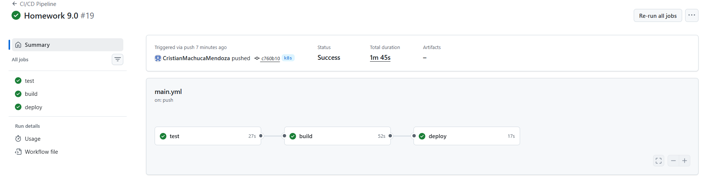
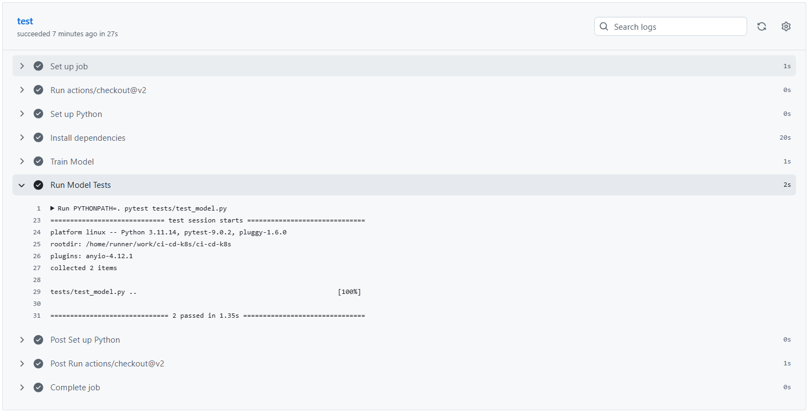
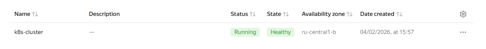
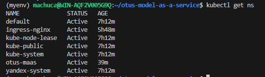
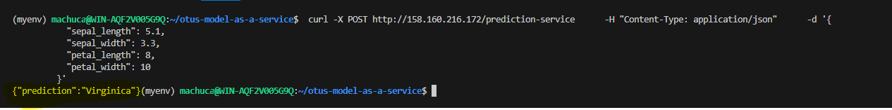
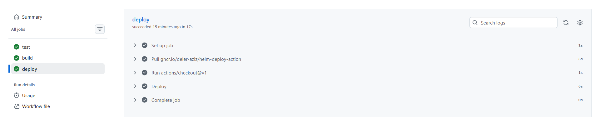

# Обновление модели

## Домашнее задание №9

## 1. Написать REST API для вашей модели для ее взаимодействия с внешними сервисами.

https://github.com/CristianMachucaMendoza/ci-cd-k8s/blob/k8s/src/app.py

## 2.  Настроить CI/CD пайплайн в GitHub Actions с тестами вашей модели. В случае успешного прохождения тестов настройте CI/CD для автоматической сборки docker образа и его публикацией в registry.

https://github.com/CristianMachucaMendoza/ci-cd-k8s/blob/k8s/.github/workflows/main.yml
https://github.com/CristianMachucaMendoza/ci-cd-k8s/blob/k8s/tests/test_model.py

## 3. Создать k8s манифест для запуска вашего сервиса (контейнера) на Kubernetes кластере.

https://github.com/CristianMachucaMendoza/ci-cd-k8s/tree/k8s/k8s
https://github.com/CristianMachucaMendoza/ci-cd-k8s/tree/k8s/helm/otus-maas/templates

## 4. Создать в YC k8s кластер из 3-х узлов.

## 5. Запустить ваш сервис в k8s и провести тестирование через публичный API.

## 6. Добавить в CI/CD пайплайн автоматический деплой в сервиса в k8s кластер.

https://github.com/CristianMachucaMendoza/ci-cd-k8s/blob/k8s/.github/workflows/main.yml

